# QUIZ PEMROGRAMAN III (WEB SERVICE) (blum selesai)
# 1. Membuat folder dengan nama NPM_NAMA_QUIS
# 2. Membuat frontend di index.html
Untuk membuat form pendaftaran menggunakan tailwind dari https://tailwindcomponents.com/component/simple-registersign-up-form/landing 

tampilannya seperti ini
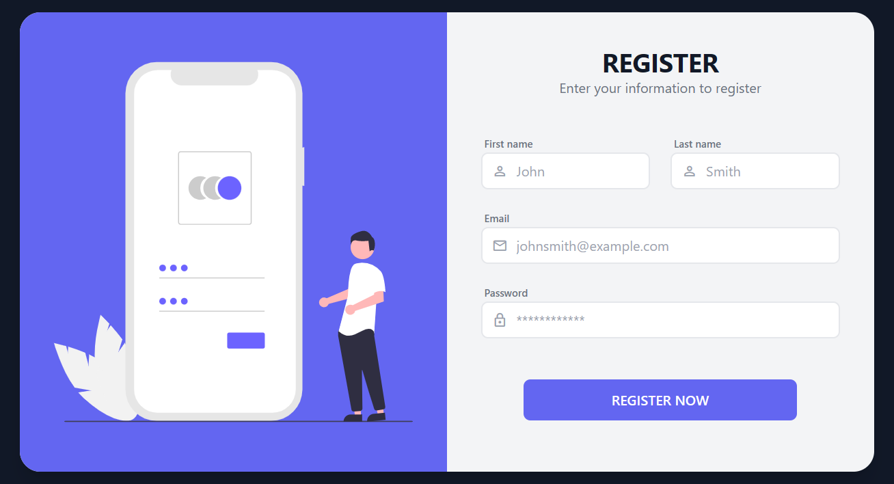
##### Gambar 1 Tampilan UI Register

Download code nya. Lalu, inspect dan cari element dari button dan field inputnya untuk diberi id.

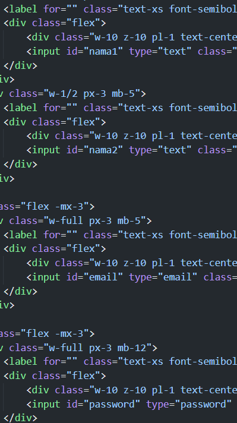
##### Gambar 2 Id untuk field input

Hubungkan file JS ke index.html sebelum penutup tag body.
```
<script src="./cobaPipe.js"></script>
```

## 3. Membuat file javascript
Pada file Javascript berisi fungsi-fungsi untuk mengirimkan data dari html ke endpoint pipedream. Fungsi dibuat agar code javascript rapih dan mudah terbaca.

1. Buat fungsi PostSignUp() yang bertujuan untuk memproses data form Sign Up melalui metode POST. Fungsi ini disalin dari postman, yang input data pada id form HTML telah dimodifikasi.

```
function PostSignUp(nama1,nama2,email,password){
  var myHeaders = new Headers();
  myHeaders.append("Login", "bismillah"); 
  myHeaders.append("Content-Type", "application/json");

  var raw = JSON.stringify({
  "nama1": nama1,
  "nama2": nama2,
  "email": email,
  "password": password,
  });

  var requestOptions = {
  method: 'POST',
  headers: myHeaders,
  body: raw,
  redirect: 'follow'
  };

  fetch("https://eop82h6od7hos3n.m.pipedream.net", requestOptions)
  .then(response => response.text())
  .then(result => GetResponse(result))
  .catch(error => console.log('error', error));
}

function GetResponse(result){
  document.getElementById("formsignup").innerHTML = result;
}
```
#
2. Pada file html button beri atribut onclick(), lalu buat fungsi PushButton() untuk melakukan aksi sehabis menng klik tombol Register Now.
```
function PushButton(){
  namadepan=document.getElementById("nama1").value;
  namabelakang=document.getElementById("nama2").value;
  emaill=document.getElementById("email").value;
  pass=document.getElementById("password").value;
  PostSignUp(nama1,nama2,email,password);
}
```
#
3. Kemudian test dengan Open with Live Server lalu isi form nya. Lihat di Pipedream, akan muncul new event yang artinya data sudah diterima dengan oleh endpoint baik itu header atau body.

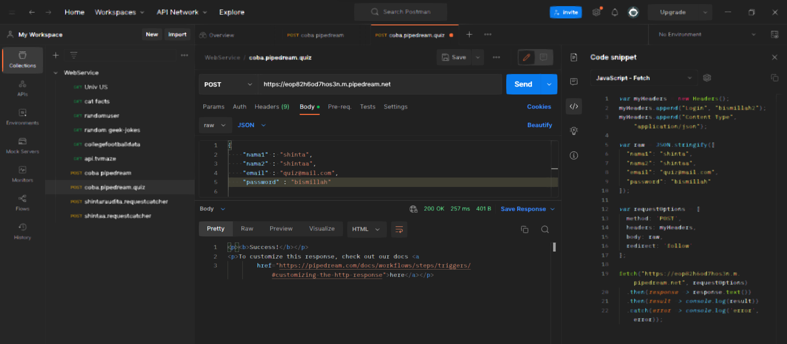
##### Gambar 3 Data ini yang seharusnya muncul di Pipedream


##### Gambar 4 Mengisi data di Form regsiter

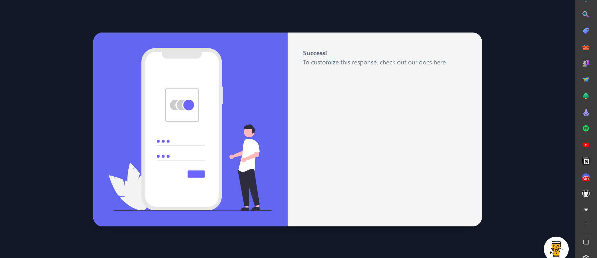
##### Gambar 5 Success mengisi data di Form regsiter


##### Gambar 6 Notifikasi New Event di Pipedream

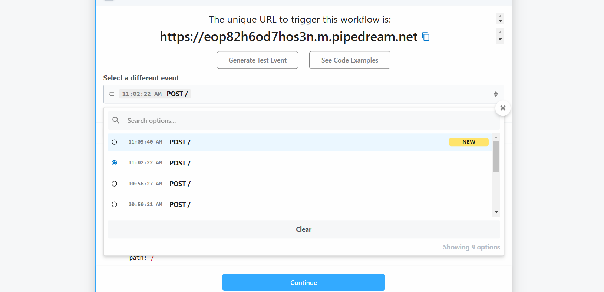
##### Gambar 7 Notifikasi New Event di Pipedream

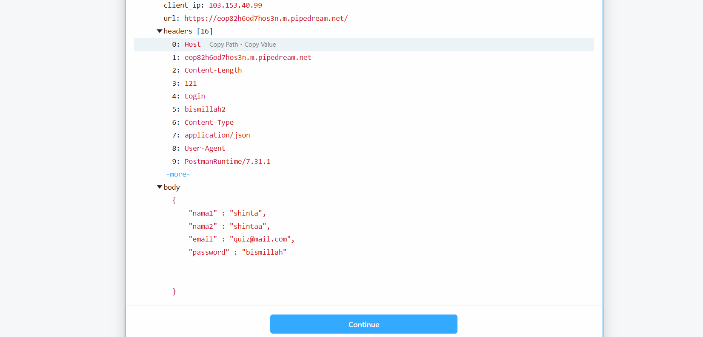
##### Gambar 8 Data dari event di Pipedream sesuai dengan yang dibuat di Postman

#

# 4. Membuat Database MongoDB
1. Log In ke MongoDB Atlas di https://account.mongodb.com/account/login
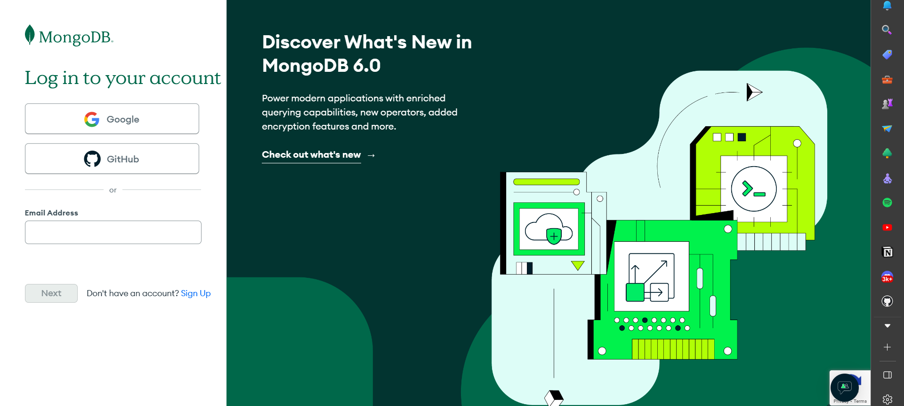
##### Gambar 9 Log In ke MongoDB Atlas

#
2. Sambungkan MongoDB Atlas dengan MongoDB Compass.
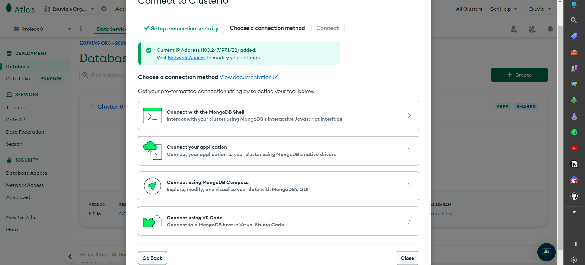
##### Gambar 10 Pilih Connect using mongodb compass

#
3. Copy connection string nya.
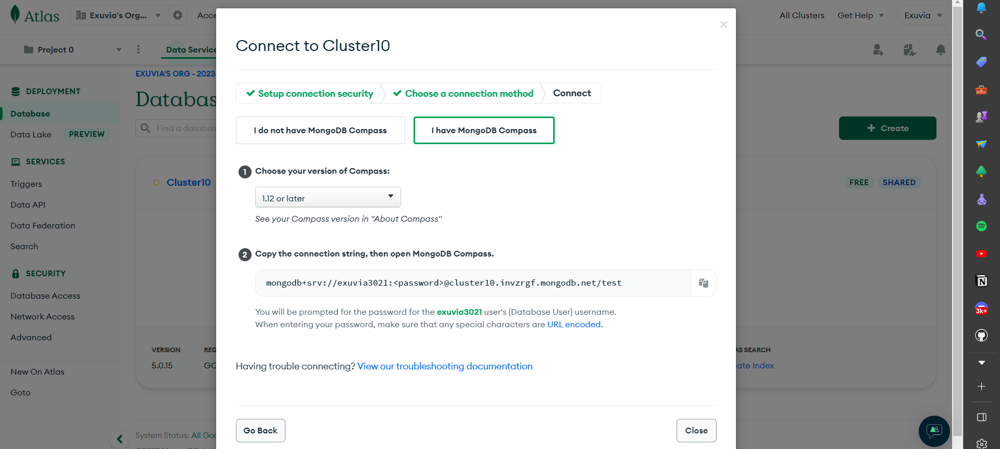
##### Gambar 11 Connection string

#
4. Paste kan connection string ke mongodb compass di tempat yang telas disediakan. Tulisan password diganti dengan password akun mongodb. Lalu, pilih connect.
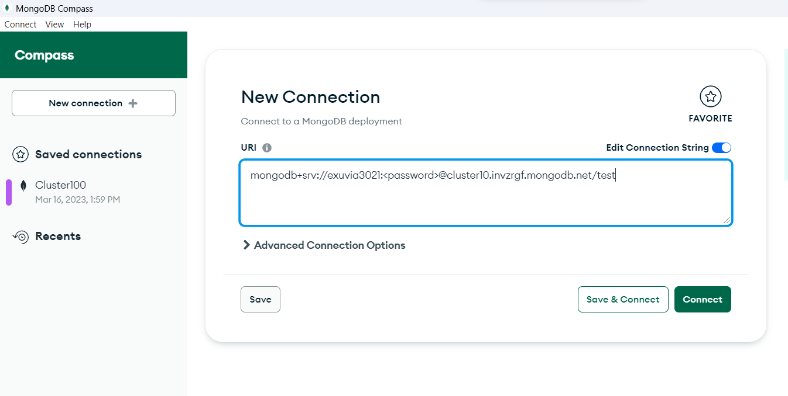
##### Gambar 12 MongoDB Compass

#

# 5. Membuat file struct, package, testing
1. Buat folder Backend untuk file go.
2. Inisiasi package yang akan di buat, arahkan ke folder kerja dan lakukan inisialisasi package di terminal dengan perintah
```
go mod init github.com/kerjabhakti/WS/Chapter03/coba
```
Maka akan muncul file go.mod
#
3. Buat file type.go berisikan struct 
```
package shintaa

import (
	"go.mongodb.org/mongo-driver/bson/primitive"
)

type Karyawan struct {
	ID           primitive.ObjectID `bson:"_id,omitempty" json:"_id,omitempty"`
	Nama         string             `bson:"nama,omitempty" json:"nama,omitempty"`
	Phone_number string             `bson:"phone_number,omitempty" json:"phone_number,omitempty"`
	Jabatan      string             `bson:"jabatan,omitempty" json:"jabatan,omitempty"`
	Jam_kerja    []JamKerja         `bson:"jam_kerja,omitempty" json:"jam_kerja,omitempty"`
	Hari_kerja   []string           `bson:"hari_kerja,omitempty" json:"hari_kerja,omitempty"`
}

type JamKerja struct {
	Durasi     int      `bson:"durasi,omitempty" json:"durasi,omitempty"`
	Jam_masuk  string   `bson:"jam_masuk,omitempty" json:"jam_masuk,omitempty"`
	Jam_keluar string   `bson:"jam_keluar,omitempty" json:"jam_keluar,omitempty"`
	Gmt        int      `bson:"gmt,omitempty" json:"gmt,omitempty"`
	Hari       []string `bson:"hari,omitempty" json:"hari,omitempty"`
	Shift      int      `bson:"shift,omitempty" json:"shift,omitempty"`
	Piket_tim  string   `bson:"piket_tim,omitempty" json:"piket_tim,omitempty"`
}

type Presensi struct {
	ID           primitive.ObjectID `bson:"_id,omitempty" json:"_id,omitempty"`
	Longitude    float64            `bson:"longitude,omitempty" json:"longitude,omitempty"`
	Latitude     float64            `bson:"latitude,omitempty" json:"latitude,omitempty"`
	Location     string             `bson:"location,omitempty" json:"location,omitempty"`
	Phone_number string             `bson:"phone_number,omitempty" json:"phone_number,omitempty"`
	Datetime     primitive.DateTime `bson:"datetime,omitempty" json:"datetime,omitempty"`
	Checkin      string             `bson:"checkin,omitempty" json:"checkin,omitempty"`
	Biodata      Karyawan           `bson:"biodata,omitempty" json:"biodata,omitempty"`
}

type Lokasi struct {
	ID       primitive.ObjectID `bson:"_id,omitempty" json:"_id,omitempty"`
	Nama     string             `bson:"nama,omitempty" json:"nama,omitempty"`
	Batas    Geometry           `bson:"batas,omitempty" json:"batas,omitempty"`
	Kategori string             `bson:"kategori,omitempty" json:"kategori,omitempty"`
}

type Geometry struct {
	Type        string      `json:"type" bson:"type"`
	Coordinates interface{} `json:"coordinates" bson:"coordinates"`
}

```
##### Note: nama package harus sama dengan file type.go, shintaa.go, dan shintaa_test.go
#
4. Kompilasi depedensi dengan perintah
```
go mod tidy
```
Setelah melakukan kompilasi depedensi maka akan muncul file go.sum
#
5. Buat file shintaa.go
```
package shintaa

import (
	"context"
	"fmt"
	"os"
	"time"

	"go.mongodb.org/mongo-driver/bson/primitive"
	"go.mongodb.org/mongo-driver/mongo"
	"go.mongodb.org/mongo-driver/mongo/options"
	"gopkg.in/mgo.v2/bson"
)

var MongoString string = os.Getenv("MONGOSTRING")

func MongoConnect(dbname string) (db *mongo.Database) {
	client, err := mongo.Connect(context.TODO(), options.Client().ApplyURI(MongoString))
	if err != nil {
		fmt.Printf("MongoConnect: %v\n", err)
	}
	return client.Database(dbname)
}

func InsertOneDoc(db string, collection string, doc interface{}) (insertedID interface{}) {
	insertResult, err := MongoConnect(db).Collection(collection).InsertOne(context.TODO(), doc)
	if err != nil {
		fmt.Printf("InsertOneDoc: %v\n", err)
	}
	return insertResult.InsertedID
}

func InsertPresensi(long float64, lat float64, lokasi string, phonenumber string, checkin string, biodata Karyawan) (InsertedID interface{}) {
	var presensi Presensi
	presensi.Latitude = long
	presensi.Longitude = lat
	presensi.Location = lokasi
	presensi.Phone_number = phonenumber
	presensi.Datetime = primitive.NewDateTimeFromTime(time.Now().UTC())
	presensi.Checkin = checkin
	presensi.Biodata = biodata
	return helper.InsertOneDoc("adorable", "presensi", presensi)
}

func GetKaryawanFromPhoneNumber(phone_number string) (staf Presensi) {
	karyawan := MongoConnect("adorable").Collection("presensi")
	filter := bson.M{"phone_number": phone_number}
	err := karyawan.FindOne(context.TODO(), filter).Decode(&staf)
	if err != nil {
		fmt.Printf("getKaryawanFromPhoneNumber: %v\n", err)
	}
	return staf
}

```
Lakuka go mod tidy lagi.
##### Note: nama package harus sama dengan file type.go, shintaa.go, dan shintaa_test.go
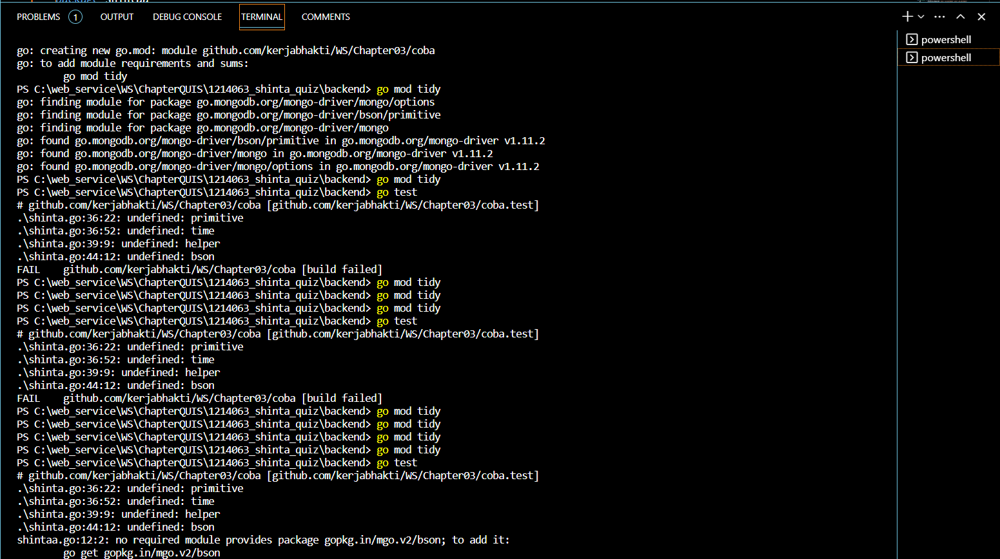
##### Gambar 13 Inisialisasi package, dan kompilasi depedensi
#
6. Setting environment variable di windows
   
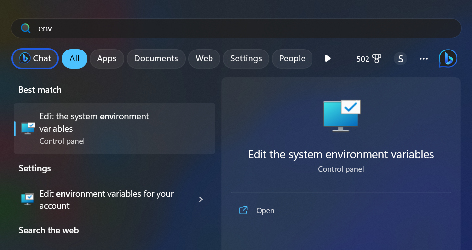
##### Gambar 14 environment variable

PIlih Environment Variables -> pilih New

Pertama, beri nama GOPROXY, value = proxy.golang.org

Kedua, beri nama MONGOSTRING, value = connection string dari MongoDB Atlas

Klik, OK
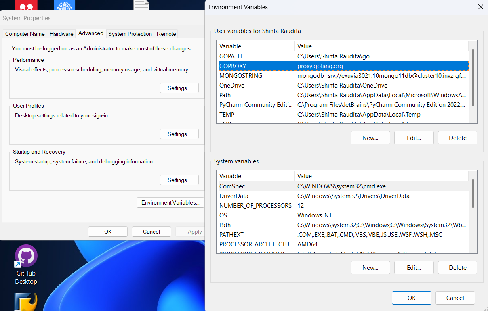
##### Gambar 15 Setting environment variable
#
7. Buat file shintaa_test.go
```
package shintaa

import (
	"fmt"
	"testing"
)

func TestInsertPresensi(t *testing.T) {
	long := 98.345345
	lat := 123.561651
	lokasi := "rumah"
	phonenumber := "6811110023231"
	checkin := "masuk"
	biodata := Karyawan{
		Nama:         "ujang",
		Phone_number: "6284564562",
		Jabatan:      "tukang sapu",
	}
	hasil := InsertPresensi(long, lat, lokasi, phonenumber, checkin, biodata)
	fmt.Println(hasil)

}

func TestGetKaryawanFromPhoneNumber(t *testing.T) {
	phonenumber := "6811110023231"
	biodata := GetKaryawanFromPhoneNumber(phonenumber)
	fmt.Println(biodata)
}

```
##### Note: nama package harus sama dengan file type.go, shintaa.go, dan shintaa_test.go

Jalaankan testing dengnan perintah 
```
go testing
```
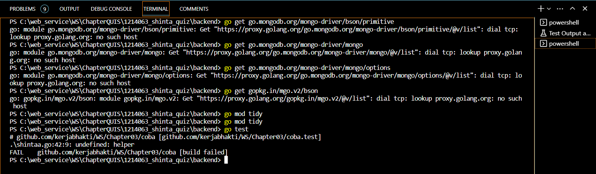
##### Gambar 16 Hasil testing
#
8. Lihat hasil testing di MongoDB Compass
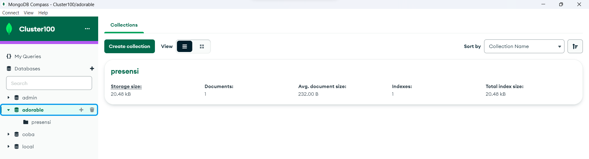
##### Gambar 17 Hasil testing di MongoDB Compass
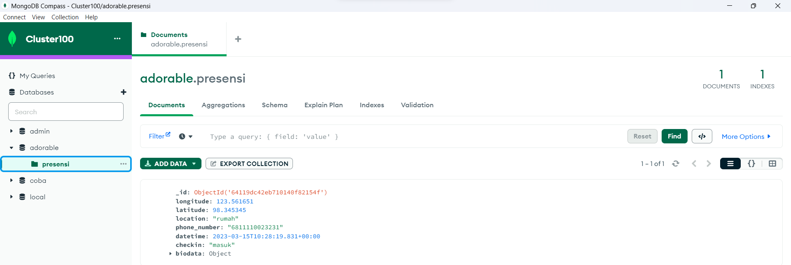
##### Gambar 18 Hasil testing di MongoDB Compass

#
### Sekian penjelasan alur proses dari saya. Terima Kasih.
#
Kepada Bapak Roni Andarsyah,

Saya mohon maaf atas keterlambatan pengumpulan quiz yang saya kerjakan. Saya ingin menjelaskan bahwa saya mengalami kesulitan untuk tersambung ke internet karena setting wifi di laptop saya tiba-tiba menghilang. Oleh karena itu, saya mengalami kesulitan untuk menulis README.md di Github yang merupakan syarat pengumpulan quiz.
Saya telah meminta persetujuan dari Bapak mengenai keterlambatan pengumpulan quiz ini dan ingin menyampaikan rasa terima kasih atas kesempatan yang diberikan.

Sekali lagi, saya memohon maaf atas ketidaknyamanan yang ditimbulkan.

Hormat Saya,

Shinta Raudita Octora Damayanti


