# 1214063_ShintaRaudita_UTS Pemograman III (WEB SERVICES)
#
# 1. Buat UI dengan componen tailwind
Code tampilan UI berada di file bernama indexApi.html
# 2. Buat fiel JS 
Code tampilan UI berada di file bernama skripApi.js
# 3. Gunakan API Public yang dapat diakses, pastikan data muncul di console
saya menggunakan API dari https://github.com/public-apis/public-apis yang https://github.com/wh-iterabb-it/meowfacts untuk menampilakn 10 data  saja,
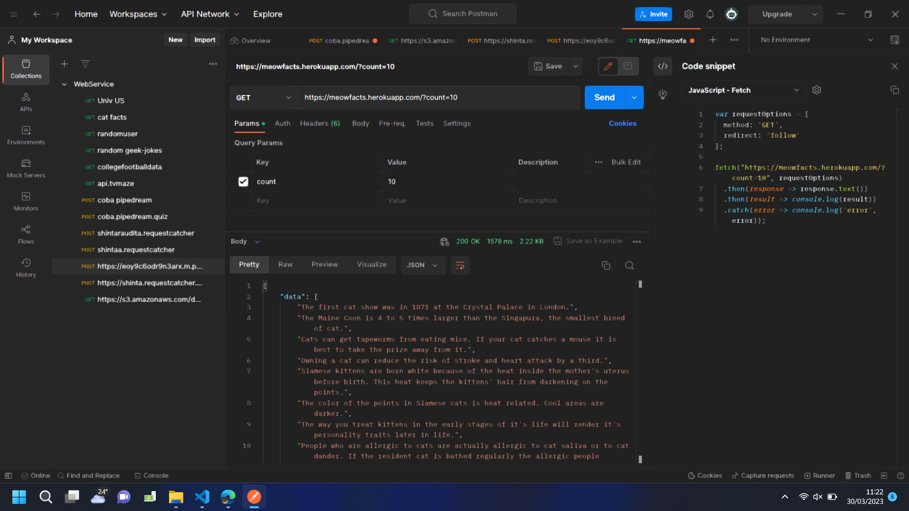
Terlihat data nya sudah muncul di console
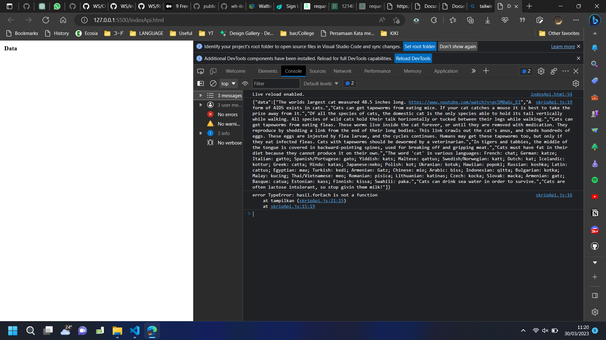

#
# 4. Lakukan pengujian https://requestcatcher.com/
1. Kunjungi link di atas
2. Isi tempat yang tersedia dengan apa saja, akan muncul tidak ada request
   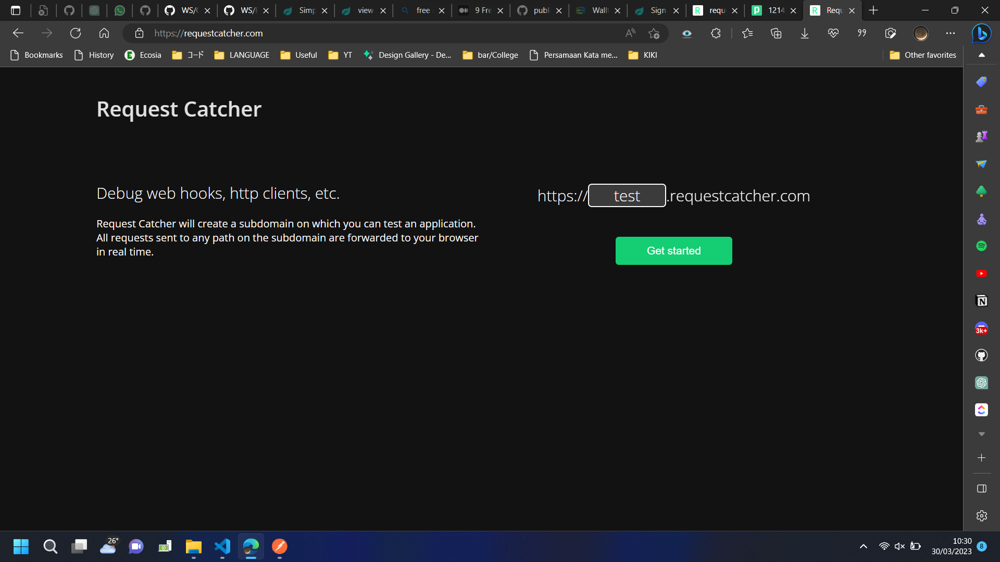
   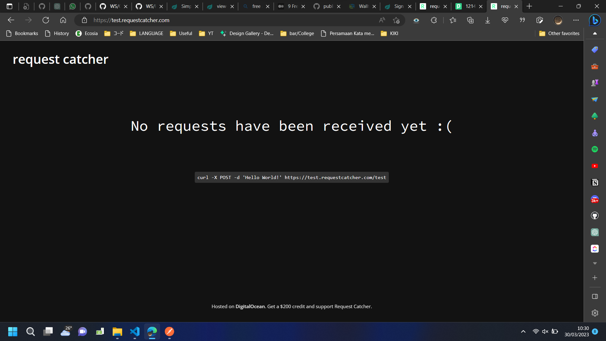
3. Copas link  https://test.requestcatcher.com/test ke Postman
4. Gunakkan metode POST. Headers isi dengan Key : Token ,   Value : Bebas. 
5. Pada body isi dengan data raw json lalu klik Send
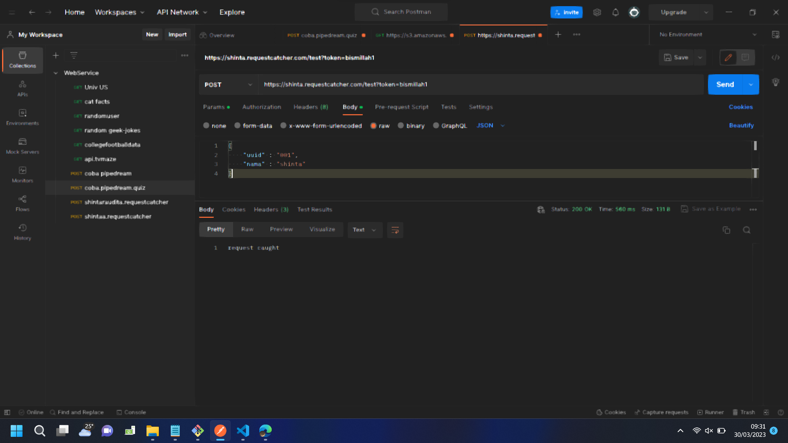
6. Requestcatcher akan menampilkan requests
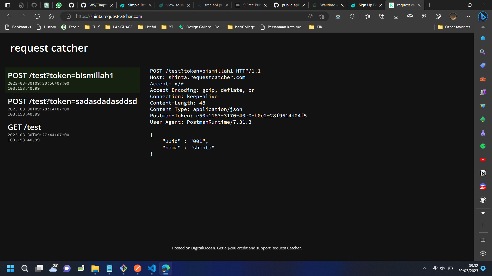

# 
# 5. Membuat Endpoint dengan Postman dari Pipedream
1. Log in ke pipedream.com dan buat workflow untuk UTS agar tidak tertukar dengan workflow proyek lainnya
2. Pilih New HTTP / Webhook REquest
3. Pilih Event Data : Raw REquest, HTTP Response : 200 OK dan klik Save and Continue
4. Akan keluar URL untuk endpoint : https://eoy9c6odr9n3arx.m.pipedream.net . lalu test Endpoint ke Postman

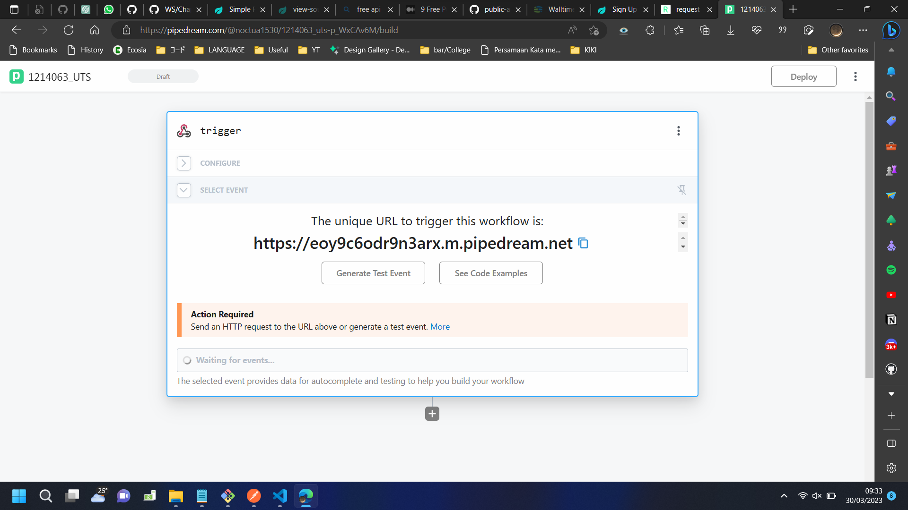

5. Copas link tersebut ke Postman dan pilih Methode POST, Params isi dengan Key : Login , Value : bismillah2, Headers isi dengan Key : Login , Value : bismillah2. Pada bagian body isi dengan data raw json dan klik Send

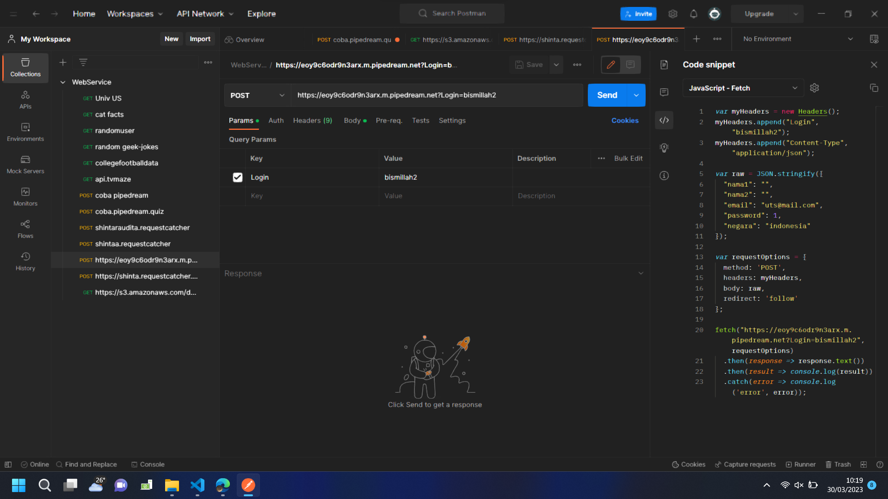
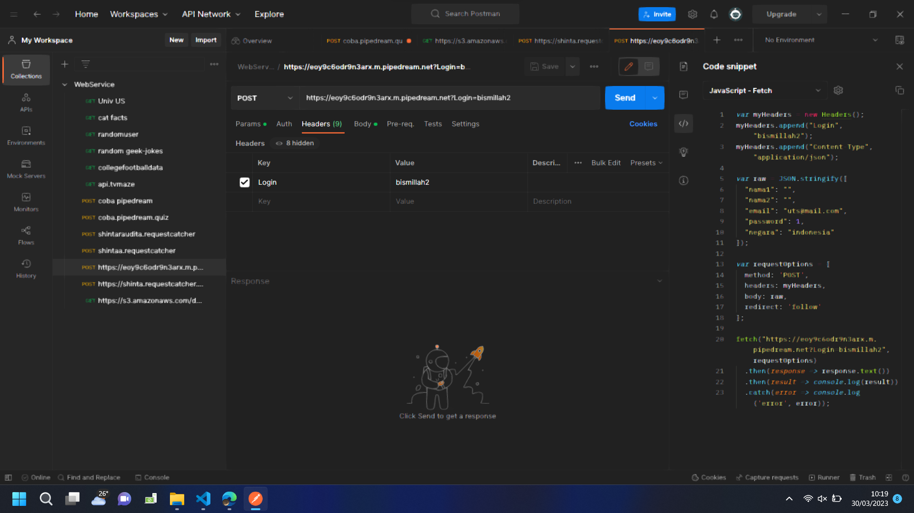
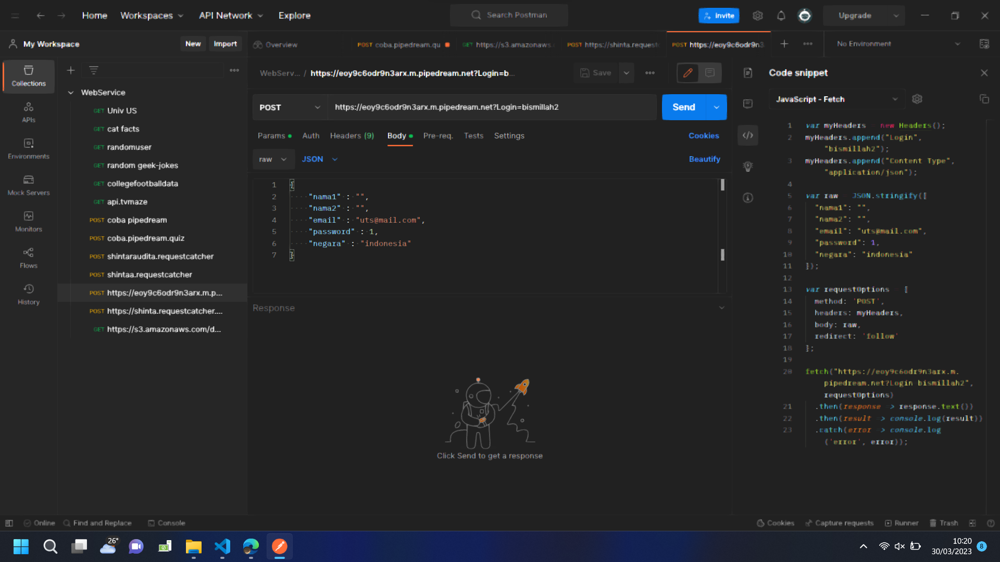

6. Di dashboard Pipedream akan muncul New Event

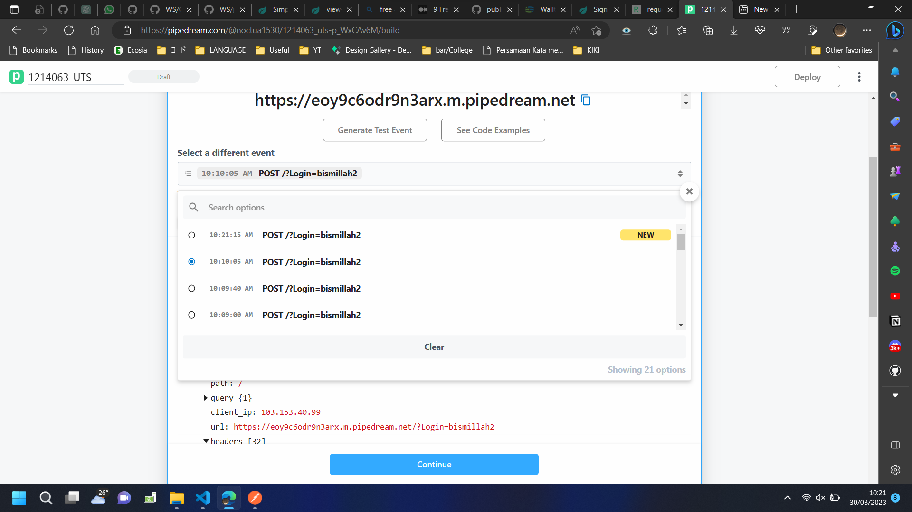
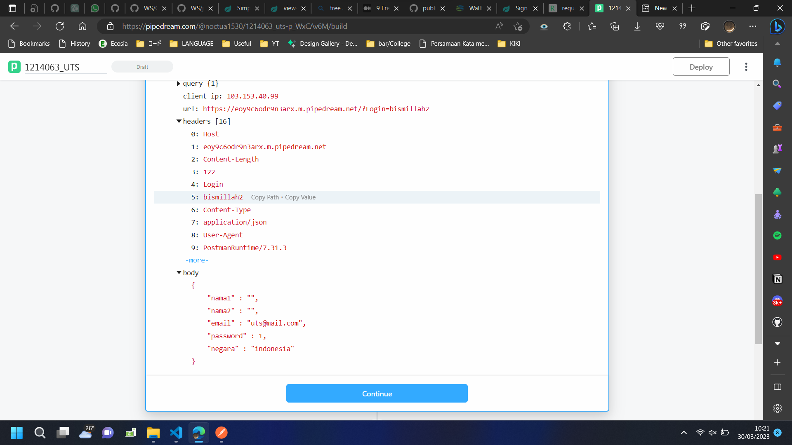

# 6. Tambah fungsi PostSignUp()
Fungsi PostSignUp() diambil dari Postman yang di ubah data input dari id form Sign Up html. Fungsi PostSignUp() berfungsi untuk melakukan Post Form Data Sign Up.

```
function PostSignUp(nama1,nama2,email,password,negara){
  var myHeaders = new Headers();
  myHeaders.append("Login", "bismillah2");
  myHeaders.append("Content-Type", "application/json");

  var raw = JSON.stringify({
    "nama1": nama1,
    "nama2": nama2,
    "email": email,
    "password": password,
    "negara": negara
  });

  var requestOptions = {
  method: 'POST',
  headers: myHeaders,
  body: raw,
  redirect: 'follow'
  };

  fetch("https://eoy9c6odr9n3arx.m.pipedream.net?Login=bismillah2", requestOptions)
  .then(response => response.text())
  .then(result => GetResponse(result))
  .catch(error => console.log('error', error));
}
```

# 7. Buat fungsi PushButton()
fungsi PushButton() untuk melakukan aksi setelah menekan tombol, pada bagian html button ditambahkan atribut onclick.

```
function PushButton(){ 
  nama1=document.getElementById("nama1").value;
  nama2=document.getElementById("nama2").value;
  email=document.getElementById("email").value;
  password=document.getElementById("password").value;
  negara=document.getElementById("negara").value;
  PostSignUp(nama1,nama2,email,password,negara);
}
```

# 8. Test dengan Open with Live Server
1. Buka file dengan Open with Live Server
2. Inspect dan buka tab console
3. Isi form Sign Up dan akan muncul data success.
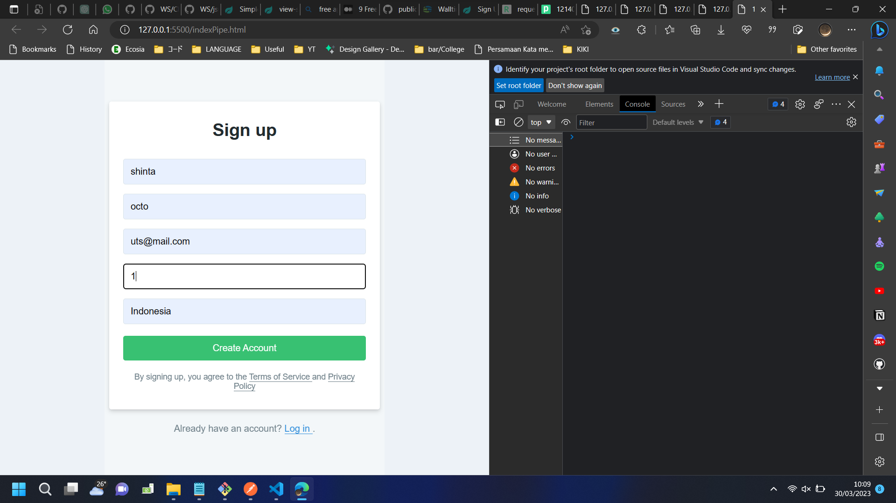
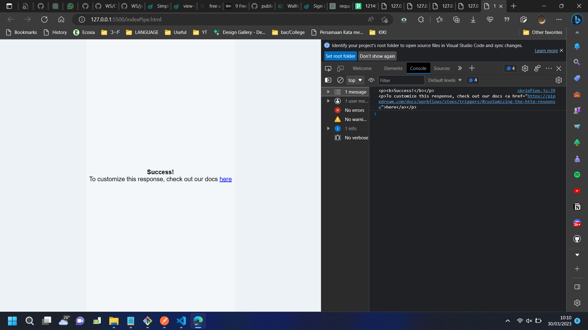
4. Di Dashboard Pipedream data sudah berhasil diterima  oleh endpoint.
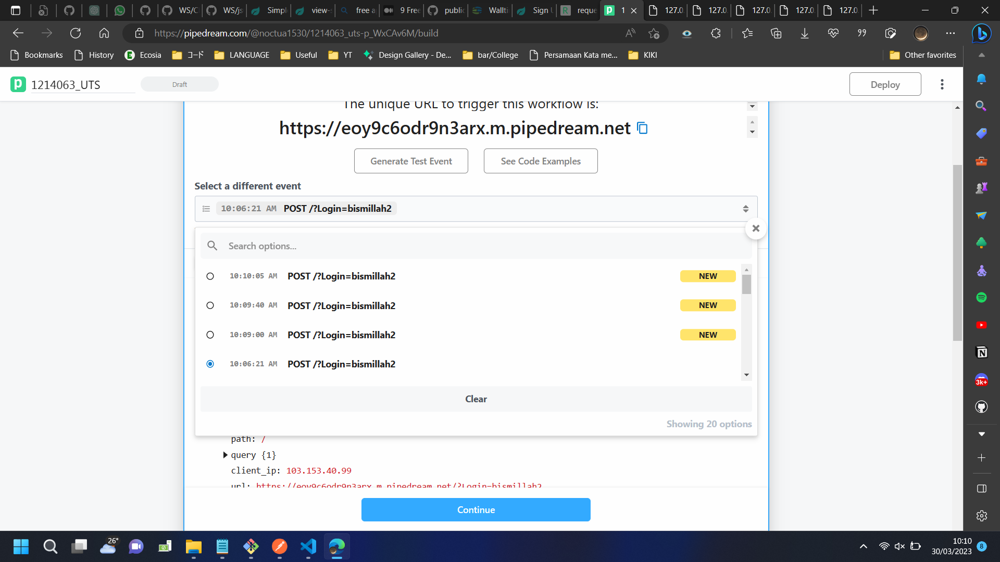
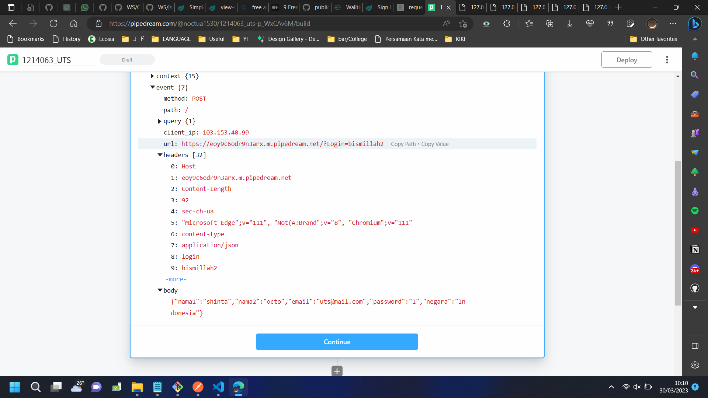

# 10. Sertakan link Github Pages
Berikut adalah link Github Pages dari repository saya.
1. https://shintaraudita.github.io/pipedream/

2. https://shintaraudita.github.io/api/
