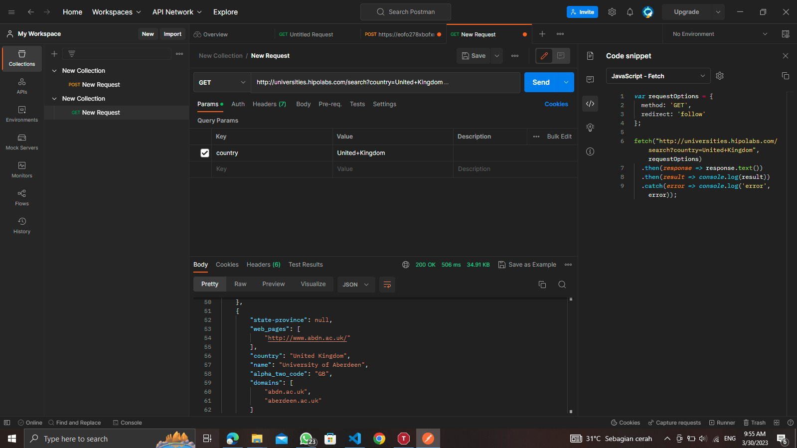
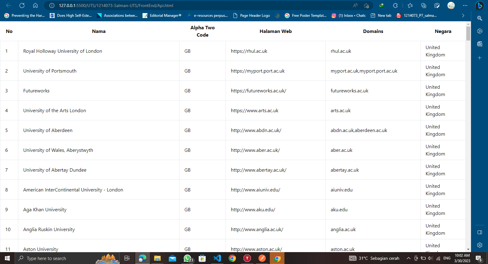

# BAGIAN 1        Membuat Tampilan FrontEnd Untuk API Public
Membuat Folder FrontEnd pada UTS/1214073-salman-UTS

## 2.Membuat File Index HTML 
Index HTML berfungsi untuk membuat kerangka Tabel menggunakan framework tailwind
```
<!DOCTYPE html>
<html lang="en">
  <head>
    <meta charset="UTF-8">
    <title>Universitas</title>
    <link rel="stylesheet" href="https://cdnjs.cloudflare.com/ajax/libs/tailwindcss/2.2.7/tailwind.min.css">
  </head>
  <body>
    <div class="container mx-auto">
      <table class="table-auto">
        <thead>
          <tr>
            <th class="px-4 py-2">No</th>
            <th class="px-4 py-2">Nama</th>
            <th class="px-4 py-2">Alpha Two Code</th>
            <th class="px-4 py-2">Halaman Web</th>
            <th class="px-4 py-2">Domains</th>
            <th class="px-4 py-2">Negara</th>
          </tr>
        </thead>
        <tbody id="konten">
        </tbody>
      </table>
    </div>

    <script src="Uji.js">
    </script>
  </body>
</html>
```
## 2.Pengujian Menggunakan Postman
Setelah Membuat kerangka, akan dilakukan pengujian API dengan menggunakan Postman, berikut hasil pengujian 


## 3.Mebuat File Javascript untuk menghubungkan api ke framwork
Dibawah terdapat script javascript, script java script tersebut berfungsi untuk menghubungkan API agar bisa tampil kedalam framework yang sudah dibuat

```
var myHeaders = new Headers();
myHeaders.append("Cookie", "connect.sid=s%3AMsnp_KW3uPWTf6gN4GDNl7XAoOShdRL2.VK05aaDbN1FeG%2BScGHtOuxENv5s2ABoZZzLpqN%2FUbZs");

var requestOptions = {
  method: 'GET',
  headers: myHeaders,
  redirect: 'follow'
};

hasil = "";
txt = "";
txt1 = "";

fetch("http://universities.hipolabs.com/search?country=United+Kingdom", requestOptions)
  .then(response => response.text())
  .then(result => tampilkan(result))
  .catch(error => console.log('error', error));

function tampilkan(result) {
  console.log(result);
  hasil = JSON.parse(result);
  hasil.forEach(isitabel);
}

function isitabel(value, index) {
  const alpha_two_code = ""
  const web_pages = ""
  const name = ""
  const domains = ""
  const country = ""
  txt += `
    <tr>
      <td class="border px-4 py-2">${index + 1}</td>
      <td class="border px-4 py-2">${value.name}</td>
      <td class="border px-4 py-2">${alpha_two_code + value.alpha_two_code}</td>
      <td class="border px-4 py-2">${web_pages + value.web_pages}</td>
      <td class="border px-4 py-2">${domains + value.domains}</td>
      <td class="border px-4 py-2">${country + value.country}</td>
    </tr>
  `;
  document.getElementById("konten").innerHTML = txt;
}
```
Berikut ini adalah tampilan Menggunakan live server



## 4.Pengujian Pada RequestCatcher
Masuk pada halaman website https://requestcatcher.com/
lalu buka salin urlnya, masukan kedalam postman dan send
.png)
Lalu buka kembali requestcatcher nya maka akan ada perubahan sesuai permintaan yang kita kirim seperti berikut ini
.png)

## 5.Membuat Endpoint Menggunakan postman dari PipeDream
Untuk Mengintegrasikan inputan data agar bisa terkirim dan tersimpan dari index.html kedalam pipedream. bukalah pipedream
lalu buatlah Endpoint baru dengan klik New pada pojok kanan atas 

.png)
Lalu pilih New HTTP/Webhook
.png)
Berikutnya atur konfigurasi seperti contoh dibawah ini, jika sudah pilih opsi save & continue
.png)

salin source URLnya dan tempelkan kedalam pipedream
.png)

## 6.Membuat File HTML dan Javascript untuk membuat FormSign yang terhubung dengan pipedream

Membuat Index html, disini menggunakan bantuan framework dari tailwind untuk kerangka Form sign nya. Berikut kode htmlnya

```
<html lang="en"><head>
    <meta charset="utf-8">
    <meta http-equiv="X-UA-Compatible" content="IE=edge">
    <meta name="viewport" content="width=device-width, initial-scale=1">

    <link rel="apple-touch-icon" sizes="180x180" href="/apple-touch-icon.png">
    <link rel="icon" type="image/png" sizes="32x32" href="/favicon-32x32.png">
    <link rel="icon" type="image/png" sizes="16x16" href="/favicon-16x16.png">
    <link rel="manifest" href="/site.webmanifest">
    <link rel="mask-icon" href="/safari-pinned-tab.svg" color="#0ed3cf">
    <meta name="msapplication-TileColor" content="#0ed3cf">
    <meta name="theme-color" content="#0ed3cf">

    <meta property="og:image" content="http://tailwindcomponents.com/storage/799/temp75559.png?v=2023-03-30 03:27:59">
    <meta property="og:image:width" content="1280">
    <meta property="og:image:height" content="640">
    <meta property="og:image:type" content="image/png">

    <meta property="og:url" content="https://tailwindcomponents.com/component/sign-up-form/landing">
    <meta property="og:title" content="Sign Up Form by shubhamjainco">
    <meta property="og:description" content="A Sign Up Form for Tailwind CCSS">

    <meta name="twitter:card" content="summary_large_image">
    <meta name="twitter:site" content="@TwComponents">
    <meta name="twitter:title" content="Sign Up Form by shubhamjainco">
    <meta name="twitter:description" content="A Sign Up Form for Tailwind CCSS">
    <meta name="twitter:image" content="http://tailwindcomponents.com/storage/799/temp75559.png?v=2023-03-30 03:27:59">

    <title>Sign Up Form by shubhamjainco. </title>

            <link href="https://unpkg.com/tailwindcss@0.3.0/dist/tailwind.min.css" rel="stylesheet">
    <script src="chrome-extension://ajdpfmkffanmkhejnopjppegokpogffp/assets/prompt.js"></script></head>
<body class="bg-gray-200">
    <div class="fixed bottom-0 left-0 right-0 z-40 px-4 py-3 text-center text-white bg-gray-800">
        This a Sign Up Form by shubhamjainco. 
        <a class="text-gray-200 underline" href="https://tailwindcomponents.com/component/sign-up-form">Component details</a>
    </div>
    <div class="bg-grey-lighter min-h-screen flex flex-col">
            <div class="container max-w-sm mx-auto flex-1 flex flex-col items-center justify-center px-2">
                <div class="bg-white px-6 py-8 rounded shadow-md text-black w-full">
                    <h1 class="mb-8 text-3xl text-center">Sign up</h1>
                    <input id="fullname" type="text" class="block border border-grey-light w-full p-3 rounded mb-4" name="fullname" placeholder="Full Name">

                    <input id="email"type="text" class="block border border-grey-light w-full p-3 rounded mb-4" name="email" placeholder="Email">

                    <input id="password"type="password" class="block border border-grey-light w-full p-3 rounded mb-4" name="password" placeholder="Password">
                    <input id="confirm_password"type="password" class="block border border-grey-light w-full p-3 rounded mb-4" name="confirm_password" placeholder="Confirm Password">

                    <button onclick="PushButton()" id="tombol" type="submit" class="w-full text-center py-3 rounded bg-green text-white hover:bg-green-dark focus:outline-none my-1">Masuk Sini</button>

                    <div class="text-center text-sm text-grey-dark mt-4">
                        By signing up, you agree to the 
                        <a class="no-underline border-b border-grey-dark text-grey-dark" href="#">
                            Terms of Service
                        </a> and 
                        <a class="no-underline border-b border-grey-dark text-grey-dark" href="#">
                            Privacy Policy
                        </a>
                    </div>
                </div>

                <div class="text-grey-dark mt-6">
                    Already have an account? 
                    <a class="no-underline border-b border-blue text-blue" href="">
                        Log in
                    </a>.
                </div>
            </div>
        </div>

        <script src="sign.js"></script>
</body></html>
```
Tahap selanjutnya adalah membuat fungsi dan method pada Javascript, agar ketika kita mengisikan form sign, data yang di inputkan akan masuk kedalam pipe dream. Berikut adalah Kode program Javascript yang sudah terdapat Fungsi-Fungsi yang Dibutuhkan

```
function PostSignUp(fullname,email,password,confirm_password){
  var myHeaders = new Headers();
  myHeaders.append("Register", "daftar jadi ganteng");
  myHeaders.append("Content-Type", "application/json");

  var raw = JSON.stringify({
      "namadepan": fullname,
      "email": email,
      "password": password,
      "confirm_password": confirm_password
  });

  var requestOptions = {
      method: 'POST',
      headers: myHeaders,
      body: raw,
      redirect: 'follow'
    };
    
    fetch("https://eoqdq1kfwxflony.m.pipedream.net", requestOptions)
      .then(response => response.text())
      .then(result => console.log(result))
      .catch(error => console.log('error', error));}

      function PushButton(){
        fullname=document.getElementById("fullname").value;
        email=document.getElementById("email").value;
        password=document.getElementById("password").value;
        confirm_password=document.getElementById("confirm_password").value;
        PostSignUp(fullname,email,password,confirm_password);
      }
      function GetResponse(result){
        document.getElementById("formsignup").innerHTML = result;
    }
```
Jika sudah, Kita melakukan Test dengan bantuan ekstensi live server pada visual studio code, maka hasilnya akan seperti berikut ini
.png)
coba kita inputkan data pada form lalu Buka console, apakah data yang kita inputkan sukses
.png)
jika sukses langkah terakhir kita cek pipedream kita, harusnya data yang kita inputkan masuk 
.png)
data berhasil masuk 

Demikian Hasil Pengerjaan saya, Terimakasih 