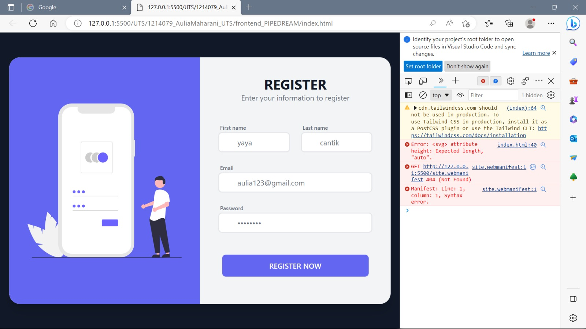
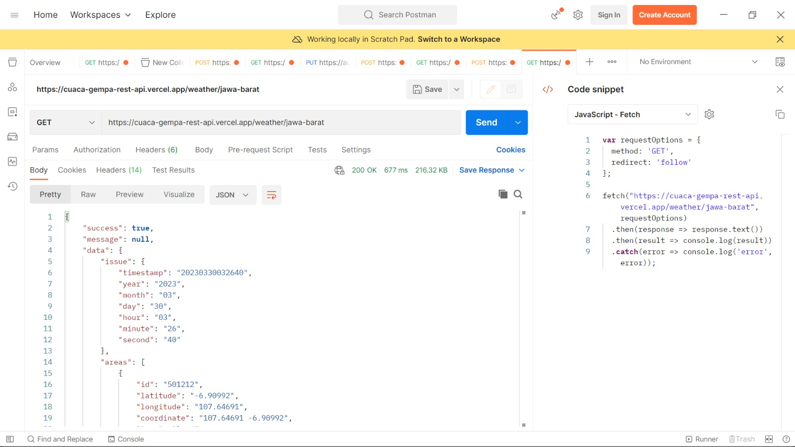
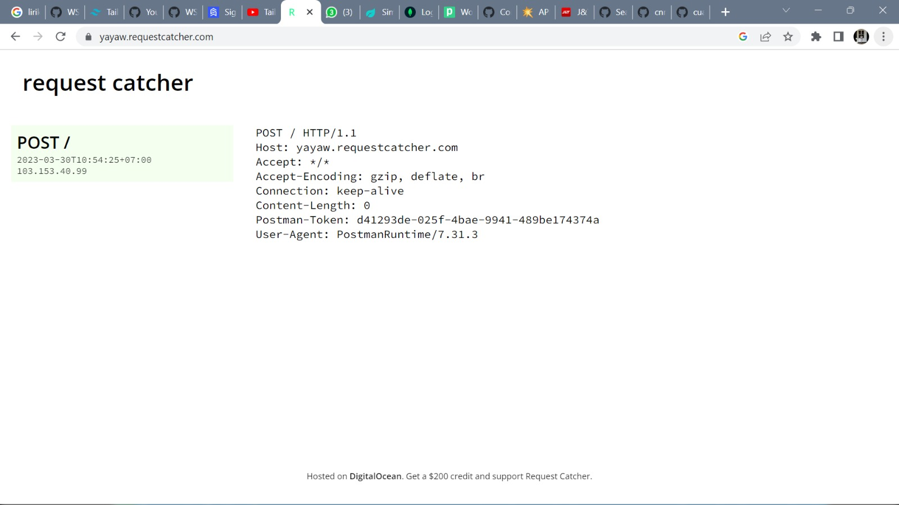
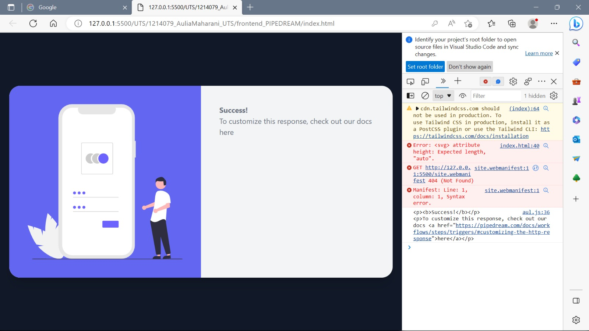

# UTS YAYA
Membuat tampilan frontend menggunakan componen pada tailwinds(index)


Membuat file js untuk menghubungkan frontend dengan css pada componen tailwinds
```
var myHeaders = new Headers();
myHeaders.append("Cookie", "connect.sid=s%3AMsnp_KW3uPWTf6gN4GDNl7XAoOShdRL2.VK05aaDbN1FeG%2BScGHtOuxENv5s2ABoZZzLpqN%2FUbZs");

var requestOptions = {
  method: "GET",
  redirect: "follow",
};
fetch("https://cuaca-gempa-rest-api.vercel.app/weather/jawa-barat", requestOptions)
  .then((response) => response.text())
  .then((result) => console.log(result))
  .catch((error) => console.log("error", error));
hasil = "";
txt = "";
txt1 = "";


function tampilkan(result) {
  console.log(result);
  hasil = JSON.parse(result);
  txt = hasil.forEach(isitabel);
}

function isitabel(value) {
  txt = txt + trnyatabel.replace("#TEXT#", "type: " + value.issue + "");
  txt = txt + trnyatabel.replace("#TEXT#", "setup: " + value.areas + "");
  txt = txt + trnyatabel.replace("#TEXT#", "punchline: " + value.punchline + "");

  document.getElementById("konten").innerHTML = txt;
}
trnyatabel = `
    <div class="font-medium text-gray-700" id="name">#TEXT#</div>
  `;
```

Gunakan API public yang dapat diakses dan lakukan pengujian pada postman, pastikan data variable tampil pada console


Lakukan pengujian pada REQUEST CATCHER


Membuat EndPoint menggunakan postman dari pipedream
```
function PushButton(){
    namadepan=document.getElementById("namadepan").value;
    namabelakang=document.getElementById("namabelakang").value;
    email=document.getElementById("email").value;
    password=document.getElementById("password").value;
    PostSignUp(namadepan,namabelakang,email,password);
}

function PostSignUp(namadepan,namabelakang,email,password){
    var myHeaders = new Headers();
    myHeaders.append("Login", "chapteruts_auliauts");
    myHeaders.append("Content-Type", "application/json");

    var raw = JSON.stringify({
        "namadepan": namadepan,
        "namabelakang": namabelakang,
        "email": email,
        "password": password
    });

    var requestOptions = {
        method: 'POST',
        headers: myHeaders,
        body: raw,
        redirect: 'follow'
    };

    fetch("https://eo1j0gkmue5hs83.m.pipedream.net", requestOptions)
        .then(response => response.text())
        .then(result => GetResponse(result))
        .catch(error => console.log('error', error));
    }
    function GetResponse(result) {
        document.getElementById("formsignup").innerHTML = result;
        
        console.log(result)
      }
```

Tambahkan fungsi PostSignUp() untuk melakukan aksi tombol, pada bagian html button tambahkan atribut OnClick

```
function PostSignUp(namadepan,namabelakang,email,password){
    var myHeaders = new Headers();
    myHeaders.append("Login", "chapteruts_auliauts");
    myHeaders.append("Content-Type", "application/json");

    var raw = JSON.stringify({
        "namadepan": namadepan,
        "namabelakang": namabelakang,
        "email": email,
        "password": password
```
```
  <div class="flex -mx-3">
                            <div class="w-full px-3 mb-5">
                                <button onclick="PushButton()" id="tombol" class="block w-full max-w-xs mx-auto bg-indigo-500 hover:bg-indigo-700 focus:bg-indigo-700 text-white rounded-lg px-3 py-3 font-semibold">REGISTER NOW</button>
                            </div>
```

Test dengan cara Live Server, lalu inspect, lalu console, lalu input
 
Klick bagian Register Now, lihat di bagian console untuk mengetahui apakah succses

ini akan masuk ke pipedream, kita cek di pipedreamnya

